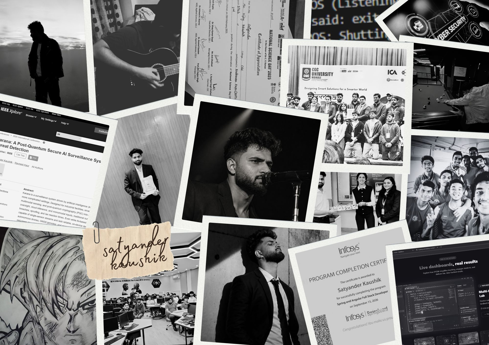
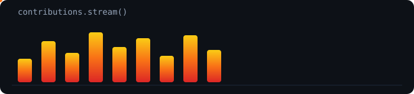
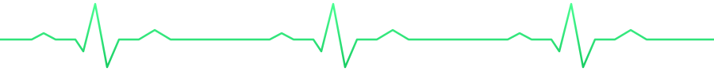
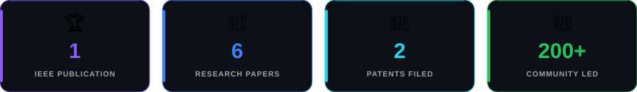
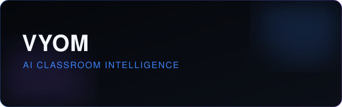
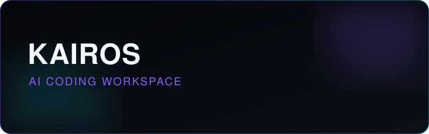

<div align="center">



<br/>


<p>
  
  
  
  
</p>

*"Turning ideas into real-world impact."*

</div>
<div align="center">
 
</div>
<table>
<tr>
<td width="30%" valign="top">

<div align="center">


### SATYANDER KAUSHIK
**@Satyanderkaushik2004**

AI & Data Science Student <br/>
IEEE‑Published Researcher <br/>
Founder — ICA Innovation Club

📍 Chandigarh, India <br/>
📧 [satyanderkaushik2004@gmail.com](mailto:satyanderkaushik2004@gmail.com)

**[→ Let's build something](https://linkedin.com/in/satyanderkaushik)**

<br/>

[](https://github.com/Satyanderkaushik2004)
[](https://linkedin.com/in/satyanderkaushik)
[](https://vyomedu.in/)

<br/>


<br/><br/>


</div>

</td>
<td width="70%" valign="top">



<br/>


<br/><br/>

<div align="center">


<br/><br/>



</div>

</div>

</td>
</tr>
</table>

<div align="center">
<picture>
  <source media="(prefers-color-scheme: dark)" srcset="https://raw.githubusercontent.com/Satyanderkaushik2004/Satyanderkaushik2004/output/github-contribution-grid-snake-dark.svg">
  
</picture>
<br/>

</div>

<br/>

## 🧠 About Me

I build at the intersection of **multimodal AI, computer vision, LLM systems, and secure AI research** — an AI & Data Science undergraduate at CGC University, Mohali.

I'm an IEEE-published researcher with two patent applications filed in India, and I founded a 200+ member university innovation community that has run a 300+ participant hackathon and hosted guest lectures on quantum computing for 100+ students.

<div align="center">

</div>

<br/>

```bash
$ cat philosophy.txt

I don't just study AI — I build systems that turn
research ideas into working software, then write
up what I learned.
```

<br/>

## Tech Stack

<div align="center">

**Core Languages**
<br/>


<br/>

**AI · Machine Learning · Computer Vision**
<br/>

<br/>


<br/>

**Cloud · MLOps · Tools**
<br/>


<br/>

**Security · Systems Research**
<br/>


</div>
<br/>
## 🚀 Currently Building

<table>
<tr>
<td width="33%" valign="top">


### 🧠 VYOM
AI classroom intelligence — federated learning across student devices, real-time collaborative updates with no centralized data. Validated with **150+ students** in a live college dry run.


**[Working site →](https://vyomedu.in/)**

</td>
<td width="33%" valign="top">


### ⚡ KAIROS
AI-native coding workspace — an editor combined with multi-provider LLM assistants and agent-style workflows for everyday development.


</td>
<td width="33%" valign="top">


### 🔒 BitVault
Security-focused file sharing — encrypted workflows and QR-based sharing links, built with a security-first design.


</td>
</tr>
</table>

**Research, always in the background:** post-quantum cryptography, federated learning, transformer architectures for computer vision, and multi-model LLM orchestration.


<br/>

## 💼 Featured Projects

<table>
<tr>
<td width="33%">



**VYOM** — AI Classroom Intelligence
<br/>Privacy-preserving classroom intelligence with federated learning; validated with 150+ students in a live dry run.


[Working Site](https://vyomedu.in/) · [Repo →](https://github.com/Satyanderkaushik2004/vyom)

</td>
<td width="33%">



**KAIROS** — AI Coding Workspace
<br/>An editor + multi-provider LLM assistant workspace with agent-mode workflows for real development work.


[Repo →](https://github.com/Satyanderkaushik2004/kairos)

</td>
<td width="33%">


**BitVault** — Secure File Sharing
<br/>Encrypted file-sharing workflows with QR-based sharing and security-first design.


[Repo →](https://github.com/Satyanderkaushik2004/bitvault)

</td>
</tr>
</table>


<br/>

## 📚 Research & Publications

| Status | Work | Venue |
|:---|:---|:---|
|  | [**Karana** — Post-Quantum Secure AI Surveillance System for Autonomous Multimodal Threat Detection](https://ieeexplore.ieee.org/document/11385607) | IEEE Conference, 2025 |
|  | **Threat Modeling and Attack Surface Analysis in AI-Driven IoT Systems** | Book Chapter — *Cybersecurity in the Age of AI and IoT* |
|  | [**BLEED** — A Stateless, Encrypted BLE Broadcast Protocol for Secure Communication](https://drive.google.com/file/d/1G1ktDJAl8HO-dkc-XqfWgqnpGBxflckE/view?usp=sharing) | — |
|  | [**Sahay AI** — Self-Healing Adaptive Multi-Model AI Orchestration Framework](https://drive.google.com/file/d/1cqkRIkDO_A1YfmMWn5VMNHWTlk_VXyy0/view?usp=sharing) | — |
|  | [**QTrialNet** — Quantum Search Framework for Multi-Hypothesis Evaluation](https://drive.google.com/file/d/1E-KlOw8FoDyPFEvMkEusi15hWv-39Oie/view?usp=sharing) | — |
|  | [**CollabCast** — Unified Digital Collaboration Platform](https://drive.google.com/file/d/1FjV31-96MJ3p_46xyBdspr_ABKC6Utlu/view?usp=drive_link) | — |
|  | [**NeuroMesh** — AI-Driven Brain-to-Robot Interface](https://drive.google.com/file/d/1F6fUWqj5LW7ePeqd2BAtaiiEjruTVa0R/view?usp=sharing) | — |

> **Karana** fuses visual, audio, and sensor streams for real-time autonomous threat classification, secured with CRYSTALS-Kyber post-quantum cryptography and optimized for low-latency edge inference.
> **Sahay AI** performs performance-aware dynamic routing across multiple LLMs with automatic failover.
> **QTrialNet** reformulates hypothesis evaluation as a Grover-inspired quantum search, achieving theoretical O(√N/M) complexity.

<br/>


**🔐 Patents Filed (India)**

| Application No. | Title |
|:---|:---|
| `202511074784` | A Quantum-Secure Edge-Based Multimodal AI Surveillance System |
| `202511087408` | A Stateless Encrypted BLE Broadcast System |

<br/>


## 📊 GitHub Analytics

<div align="center">


<br/><br/>


</div>


<br/>

## 🏅 Achievements & Recognition

| | |
|:---|:---|
| 🚀 **Founder — ICA Innovation Club** | Grew and leads a 200+ member university innovation community |
| 🎤 **Guest Speaker** | AI & quantum computing sessions for 100+ students |
| 🏆 **Event President** | Ran a 24-hour hackathon with 300+ participants |
| 📚 **Self-Published Author** | 6 technical books (programming workbooks & research templates) via Amazon KDP |

**Certifications:** EC-Council CEH v13 · CompTIA Data+ · Government-certified C/C++ and Java/JavaScript programming · 100 Days of Python · Linux Bootcamp
<br/>

## 🤝 Let's Connect

<div align="center">

[](https://github.com/Satyanderkaushik2004)
[](https://linkedin.com/in/satyanderkaushik)
[](mailto:satyanderkaushik2004@gmail.com)
[](https://vyomedu.in/)

*Open to collaboration · internships · research · cool ideas*

<br/>



<sub>[↑ Back to top](#satyander-kaushik)</sub>

</div>
